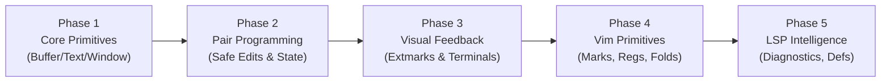

# Neovim-Boss (`nb`): Next Steps Based on MCP Server Comparison

This document synthesizes findings from the comprehensive [Neovim MCP Servers Review & Comparison](file:///Users/justinhj/projects/neovim-boss/plans/nvim-mcp-review.md) across the four primary Neovim MCP servers:
1. **`linw1995/nvim-mcp`** (Rust) — *The Code Intelligence & LSP Proxy*
2. **`paulburgess1357/nvim-mcp`** (Python) — *The Interactive Pair-Programming Partner*
3. **`bigcodegen/mcp-neovim-server`** (TypeScript / Node.js) — *The Native Vim Workflow Automator*
4. **`cousine/neovim-mcp`** (Go) — *The Modular Neovim RPC Bridge*

It outlines how `neovim-boss` currently compares against each server, extracts key architectural lessons, and establishes a concrete, phased roadmap for `nb`.

---

## 1. Current State of `neovim-boss`

`neovim-boss` brings a uniquely powerful combination of traits to the ecosystem:

* **High-Performance Native Engine**: Written in Zig (v0.16+), compiling to a single native binary (`nb`) with zero runtime dependencies, instant startup (<1ms), and minimal memory overhead.
* **Complete Typed API Layer**: Auto-generated strongly-typed wrappers for all 260+ Neovim RPC functions directly in [`src/api.zig`](file:///Users/justinhj/projects/neovim-boss/src/api.zig) from [`data/api_info.msgpack`](file:///Users/justinhj/projects/neovim-boss/data/api_info.msgpack), featuring object-oriented methods on `Buffer`, `Window`, and `Tabpage`.
* **Multi-Transport & Connection Flexibility**: Smart auto-detection connecting to Unix domain sockets, TCP sockets (`host:port`), child embedded instances (`nvim --embed --headless`), and `stdio`.
* **Zero Neovim Plugin Requirement**: Full functionality operates out-of-the-box over native Neovim RPC sockets without requiring companion Lua plugins.
* **MCP Foundation**: High-efficiency JSON-RPC 2.0 stdio server, `eval_vimscript` tool, and a rich `neovim://buffers` resource with complete metadata (`listed`, `loaded`, `modified`, `hidden`, `windows`, `line_count`, `cursor_line`, `filetype`, `buftype`, and `last_used`).

---

## 2. Proximity & Gap Analysis

```
+----------------------------------------------------------------------------------------------------+
|                                    NEOVIM-BOSS PROXIMITY SPECTRUM                                  |
+----------------------------------------------------------------------------------------------------+

  [=====================>.......................................]  ~25%  linw1995 (Rust: LSP Hub)
  [========================================>....................]  ~50%  paulburgess1357 (Python: Pair Partner)
  [=================================================>...........]  ~60%  mcp-neovim-server (TS: Vim Primitives)
  [=================================================================>]  ~80%  cousine (Go: Modular RPC Bridge)
```

### 1. `cousine/neovim-mcp` (Go) — **Closest Architectural Twin (~80% Proximity)**
* **Synergy**: Both projects emphasize a fast, compiled static binary without external runtimes, structured around clean primitives.
* **`nb`'s Advantage**: `nb` already has the entire typed C API in [`src/api.zig`](file:///Users/justinhj/projects/neovim-boss/src/api.zig), smarter address auto-detection, and a more comprehensive `neovim://buffers` resource.
* **Gap to Close**: Expose the modular MCP tool dispatch wrappers (`get_buffer_lines`, `set_buffer_lines`, `insert_text`, `delete_lines`, `get_cursor`, `set_cursor`, `split_window`, `resize_window`).

### 2. `bigcodegen/mcp-neovim-server` (TS) — **Vim Primitives (~60% Proximity)**
* **Synergy**: Focus on native Vim editing vocabulary.
* **`nb`'s Advantage**: Zero Node.js runtime dependency, significantly lower latency, and arena-managed memory allocations.
* **Gap to Close**: Implement tool wrappers for marks (`nvim_get_mark`), registers (`nvim_get_register`), jump lists, folds, and MCP Prompts.

### 3. `paulburgess1357/nvim-mcp` (Python) — **Interactive Pair Programming (~50% Proximity)**
* **Synergy**: Zero-plugin architecture communicating directly over native Unix domain sockets.
* **Key Lessons to Adopt**:
  * **Safe in-memory edits**: Provide `find_and_replace_buf` (matching unique substrings and verifying uniqueness) rather than solely relying on line-indexed replacement.
  * **Visual annotations**: Use Neovim extmarks (`nvim_buf_set_extmark`) to render theme-aware line highlights and virtual text notes without modifying files on disk.
  * **Non-stealing terminal control**: Send commands directly to terminal job channels via `nvim_chan_send`.

### 4. `linw1995/nvim-mcp` (Rust) — **LSP Code Intelligence (~25% Proximity)**
* **Synergy**: Both compiled systems languages with high throughput.
* **Key Lessons to Adopt**:
  * Avoid requiring a companion plugin. Instead, query Neovim's built-in LSP clients via [`api.nvim_exec_lua`](file:///Users/justinhj/projects/neovim-boss/src/api.zig#L1847) calling `vim.lsp.buf_request_sync`.
  * Support streamable HTTP/SSE transport for remote container development.

---

## 3. Core Architectural Lessons for `neovim-boss`

1. **Leverage [`src/api.zig`](file:///Users/justinhj/projects/neovim-boss/src/api.zig) for Discrete Operations**:
   Use strongly-typed functions for reading/writing buffer lines, moving cursors, and splitting windows.
2. **Use Composite RPC for Bulk State**:
   Avoid sequential $N \times 5$ network round-trips. Keep bulk telemetry (buffer lists, window layouts) coalesced via composite calls (`getbufinfo()`, `getwininfo()`).
3. **Prioritize Safe In-Memory Editing**:
   AI agents perform best when editing via unique substring search-and-replace (`find_and_replace_buf`) that preserves the undo tree (`u`).
4. **Visual Feedback is a Superpower**:
   Agents that can highlight lines and post virtual text give human developers immediate visual context during pair-programming sessions.

---

## 4. Phased Implementation Roadmap



### Phase 1: Core Editing & Window Primitives *(Match Go server)*
* **Text & Buffer Tools**:
  * `get_buffer_lines`: Read line slice `[start, end]`.
  * `set_buffer_lines`: Replace line slice `[start, end]` with new content.
  * `open_buffer`: Open file into a buffer (`:edit`).
  * `switch_buffer`: Set active buffer.
* **Cursor & Window Tools**:
  * `get_cursor`: Get `(line, col)` of active window.
  * `set_cursor`: Move cursor to `(line, col)`.
  * `split_window`: Split horizontally or vertically.
  * `resize_window`: Programmatically set window width and height.

### Phase 2: Safe Editing & Situational Awareness *(Adopt Python server's strengths)*
* **Safe In-Memory Editor**:
  * `find_and_replace_buf`: Takes `find` and `replace` strings; fails if match is non-unique or absent; preserves Neovim undo history.
* **Orientation Snapshots**:
  * `get_state_brief`: Returns active window, numbered context lines around cursor, current mode (`n`, `i`, `v`), and listed buffers.

### Phase 3: Visual Annotations & Terminal Channels
* **Visual Extmarks**:
  * `highlight_range` / `clear_highlights`: Highlight lines or token ranges using theme-aware highlight groups (`DiagnosticUnderlineError`, `Visual`, etc.).
  * `add_virtual_text` / `clear_virtual_texts`: Post inline or above/below virtual text notes.
* **Terminal Integration**:
  * `send_to_terminal`: Write input directly to a terminal job channel without stealing window focus.

### Phase 4: Traditional Vim Primitives & MCP Prompts *(Adopt TS server's strengths)*
* **Vim Workflow Tools**:
  * `get_register` / `set_register`: Manipulate Vim registers (`"`, `a-z`).
  * `get_marks` / `set_mark`: Read and set marks `a-z`.
  * `search_pattern`: Search buffer using Vim regex patterns.
* **MCP Prompts**:
  * `neovim_workflow`: System prompts guiding AI agents on optimal interaction patterns with a live Neovim session.

### Phase 5: Code Intelligence & LSP Proxies *(Select tools from Rust server)*
* **LSP Integration via `nvim_exec_lua`**:
  * `get_diagnostics`: Fetch workspace/buffer LSP diagnostic errors and warnings.
  * `lsp_definition` & `lsp_references`: Jump to definitions and query symbols using running language servers.
* **HTTP / SSE Transport**:
  * Expose an optional `--http-port` alongside stdio for remote development and multi-client pairing.
